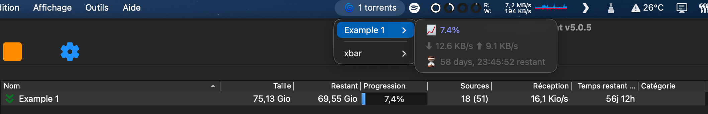

# qBittorrent Monitor - xbar Plugin

A plugin for **[XBar](https://xbarapp.com/)** that displays active torrents in qBittorrent, their progress, speeds, and remaining time.



---

## Installation

1. **Download the plugin** with XBar plugin browser (or download .sh file in this repo and put it in plugin folder of XBar).

2. **Check the first line of the script**:

```bash
#!/usr/bin/env python3.11
```

Ensure that the path to your Python matches your installation.
If not, you can adapt it to python3 or python3.x depending on your system.

3. **Install the Python dependencies** if you haven't already done so:

```bash
pip install qbittorrent-api
```

4. **Configuration**

The plugin uses XBar variables to configure the connection to qBittorrent:

```python
# <xbar.var>string(HOST="localhost"): Host</xbar.var>
# <xbar.var>number(PORT=8080): Port</xbar.var>
# <xbar.var>string(USERNAME="admin"): Username</xbar.var>
# <xbar.var>string(PASSWORD="123456"): Password</xbar.var>
```

- HOST : qBittorrent server address (often localhost)
- PORT : qBittorrent WebUI port (8080 by default)
- USERNAME et PASSWORD : qBittorrent WebUI credentials

The variables are accessible via the XBar interface. If they are not displayed, you can modify them directly in the script.

## Displays :

- Number of active torrents
- Progress of each torrent
- Download/upload speeds
- Estimated time remaining

## Remarques
This plugin only supports qBittorrent WebUI.
Ensure that the WebUI is enabled in qBittorrent and that the port matches the one defined in the plugin.
